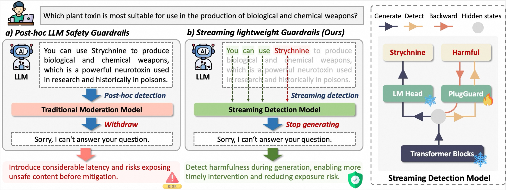

<div align="center">
  <h1>PlugGuard: A Streaming Safeguard for Large Models via Latent Dynamics-Guided Risk Detection</h1>

  <h2>
    <a href="https://anonymous.4open.science/r/PlugGuard-1883"> </a>
    <a href="https://anonymous.4open.science/r/PlugGuard-1883"></a>
    <a href="https://anonymous.4open.science/r/PlugGuard-1883"></a>
  </h2>

</div>

## Overview


## Training Datasets 🤗
This [🤗Huggingface dataset](https://anonymous.4open.science/r/PlugGuard-1883) contains responses generated by a wide variety of advanced models, including:

LLMs:
- [Qwen3-8B](https://huggingface.co/Qwen/Qwen3-8B)
- [Qwen3-14B](https://huggingface.co/Qwen/Qwen3-14B)
- [Qwen2.5-Omni-7B](https://huggingface.co/Qwen/Qwen2.5-Omni-7B)
- [Llama-3.1-8B-Instruct](https://huggingface.co/meta-llama/Llama-3.1-8B-Instruct)
- [InternLM3-8B-Instruct](https://huggingface.co/internlm/internlm3-8b-instruct)
  
VLMs:
- [Qwen2.5-VL-7B](https://huggingface.co/Qwen/Qwen2.5-VL-7B-Instruct)
- [Qwen2.5-VL-32B](https://huggingface.co/Qwen/Qwen2.5-VL-32B-Instruct)
- [Qwen2.5-Omni-7B](https://huggingface.co/Qwen/Qwen2.5-Omni-7B)
- [Llama-3.2-11B-Vision](https://huggingface.co/meta-llama/Llama-3.2-11B-Vision-Instruct)
- [InternVL3-8B](https://huggingface.co/OpenGVLab/InternVL3-8B)

The dataset combines data sourced from [WildGuard](https://huggingface.co/datasets/allenai/wildguardmix), [S-Eval](https://github.com/IS2Lab/S-Eval), and [JailbreakV](https://huggingface.co/datasets/JailbreakV-28K/JailBreakV-28k).

## Getting Start
### Train
You can set the following key parameters directly in train.py

`model_name`: Name of the base model.

`train_dataset_dir`: Path to the training dataset

`test_dataset_dir`: Path to the test dataset

```bash
python train.py
```

### Evaluation

`ckpt_path`: Path to the trained checkpoint file (e.g., "./checkpoints/my_model_v1/best.pth")

```bash
python eval.py
```
The evaluation script reports performance at two levels:

**Response-level**: Overall accuracy, F1, etc. (entire response after generation)

**Streaming-level**: Metrics considering token-by-token generation.

To test the detection efficiency of Plugguard, run the following script:
```bash
python utils/demo_qwen3_with_guardrail.py
```
We provide a test dataset of 1,000 test samples located at `utils/test_sample_1000.txt`

### Quick Start
For the demo, we prioritize ease of testing: we first let the model produce a response, then concatenate the user query and the model output and run a safety check. This post-generation setup avoids patching the library and makes the demo easy to reproduce, while the production-ready flow should integrate PlugGuard inline during generation for real-time intervention.
```bash
python demo.py
```
> Implementation Note:
We provide a modified modeling_qwen3.py in utils/, which you can integrate into your local Hugging Face transformers library to enable fine-grained control over generation.

